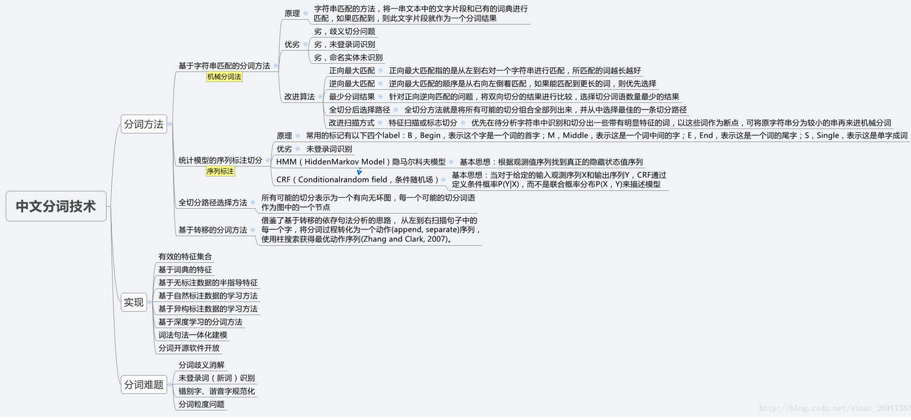

# myNLPnotebook

学习资料库 [md](./mds/学习资料库.md)

概率图模型学习笔记：HMM、MEMM、CRF [md](./mds/概率图模型学习笔记：HMM、MEMM、CRF.md)

BiLSTM介绍及代码实现 [https://www.jiqizhixin.com/articles/2018-10-24-13](https://www.jiqizhixin.com/articles/2018-10-24-13)

基于双向BiLstm神经网络的中文分词详解及源码 [https://www.cnblogs.com/vipyoumay/p/8608754.html](https://www.cnblogs.com/vipyoumay/p/8608754.html)

## NLP应用场景

从词汇、语句、篇章到系统应用不同粒度上的NLP应用场景：

* **词法短语：**分词，词性标注，命名实体识别，组块分析，Term权重，Term紧密度
* **句法语义：**语言模型，依存句法分析，词义消歧，语义角色标注，深层语义分析
* **篇章理解：**文本分类、聚类，文章摘要，文本生成，篇章关系识别，篇章衔接关系，指代消岐，语义表述，语义匹配，主题模型，情感分析，舆论监控
* **系统应用：**信息抽取，知识图谱（表示，建图，补全，推理），信息检索（索引，召回，排序），Query分析，自动问答，智能对话，阅读理解，机器翻译，语音识别，合成，OCR，图像文字生成......

---

---

## 词法短语

[秒懂词向量word2vec的本质](https://zhuanlan.zhihu.com/p/26306795)

word2vec参数 [md](./mds/word2vec.md)

### 分词

#### 分词技术路线

### 词性标注

* 词性对照表 [md](./mds/汉语词性.md)

### NER (Named Entity Recognition，命名实体识别)

* [条件随机场(Conditional random field, CRF)](https://www.cnblogs.com/Determined22/p/6915730.html)
* [BILSTM-CRF模型做基于字的中文命名实体识别](https://www.cnblogs.com/Determined22/p/7238342.html)

---

---

## 篇章理解

文本聚类过程 [md](./mds/文本聚类的过程.md)

[文本聚类](https://www.jianshu.com/p/40493f4010a9)

python使用gensim进行文本相似度计算 [https://blog.csdn.net/lom9357bye/article/details/73136117](https://blog.csdn.net/lom9357bye/article/details/73136117)

余弦相似度计算

> 对两篇文章分词
>
> 提取关键词，合并成一个集合，计算每篇文章对于这个集合中词的词频
>
> 生成两篇文章各自的词频向量
>
> 计算两个向量的余弦相似度，值越大就表示越相似
> $$
> cos(\theta) = \frac{\sum_{i=1}^{n}(A_i×B_i))}{\sqrt{\sum_{i=1}^{n}(A_i)^2}×{\sqrt{\sum_{i=1}^{n}{(B_i)^2}}}} \\ = \frac{A*B}{|A|×|B|}
> $$
> 

---

---

## 系统应用

pass

---

---

## NLP项目

维修项目笔记 [md](./mds/维修项目笔记.md)

