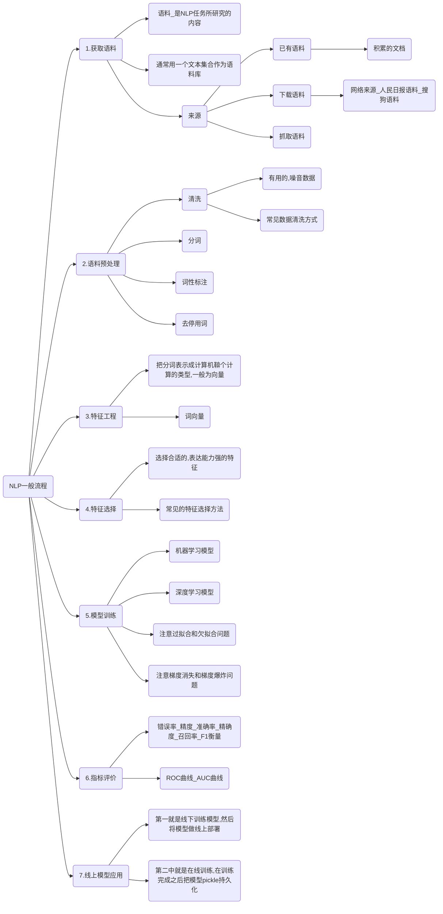

# myNLPnotebook

[关于BERT的若干问题整理记录](https://zhuanlan.zhihu.com/p/95594311)

学习资料库 [md](./mds/学习资料库.md)

概率图模型学习笔记：HMM、MEMM、CRF [md](./mds/概率图模型学习笔记：HMM、MEMM、CRF.md)

BiLSTM介绍及代码实现 [https://www.jiqizhixin.com/articles/2018-10-24-13](https://www.jiqizhixin.com/articles/2018-10-24-13)

基于双向BiLstm神经网络的中文分词详解及源码 [https://www.cnblogs.com/vipyoumay/p/8608754.html](https://www.cnblogs.com/vipyoumay/p/8608754.html)

* NLP快速入门路径

> （1）认真看完一本NLP相关的书，坚持看完一部视频。
>
> （2）看这两年相关方向的综述论文，然后看一些经典的论文和最新论文。
>
> （3）独立实现一个小型的自然语言处理项目。
>
> （4）可以在Github上找到很多相关的开源代码，选一个自己感兴趣的方向进行研究。

* NLP一般流程

https://naotu.baidu.com/file/f644044a8fb37fdba2d3d0bb4eb350e1?token=fd9855a9fc353aca

## NLP应用场景

从词汇、语句、篇章到系统应用不同粒度上的NLP应用场景：

* **词法短语：**分词，词性标注，命名实体识别，组块分析，Term权重，Term紧密度
* **句法语义：**语言模型，依存句法分析，词义消歧，语义角色标注，深层语义分析
* **篇章理解：**文本分类、聚类，文章摘要，文本生成，篇章关系识别，篇章衔接关系，指代消岐，语义表述，语义匹配，主题模型，情感分析，舆论监控
* **系统应用：**信息抽取，知识图谱（表示，建图，补全，推理），信息检索（索引，召回，排序），Query分析，自动问答，智能对话，阅读理解，机器翻译，语音识别，合成，OCR，图像文字生成......

---

---

## 词法短语

[秒懂词向量word2vec的本质](https://zhuanlan.zhihu.com/p/26306795)

word2vec参数 [md](./mds/word2vec.md)

### 分词

#### 分词技术路线

### 词性标注

* 词性对照表 [md](./mds/汉语词性.md)

* 标注词性，标注BEMS
  B：开始
  E：结束
  M/I：中间 
  S：单独

  > eg: 我想听周杰伦的夜曲
  > 1)分词：我 想听 周杰伦 的 夜曲
  > 2)BEMS和词性标注(每列用\t分隔开,一般键入tab键，windows的tab似乎有问题，可以参考用SegAndSave.class的generateSeg方法）:

  > 分词标注
  > 我 S 
  > 想 B
  > 听 E
  > 周 B
  > 杰 M
  > 伦 E
  > 的 S
  > 夜 B
  > 曲 E
  > 注：周杰伦的词性标注存在争议，周杰伦作为一个整体是nr，但 “周” “杰” “伦” 分别应该标注为什么词性，我还不确定。

  > 分词和词性同时标注（CRF只预测一列。通常做法是将词性附加在BMES后面：B_nr）
  > 我 S_rr 
  > 想 B_v
  > 听 E_v
  > 周 B_nr
  > 杰 M_nr
  > 伦 E_rn
  > 的 S_ude1
  > 夜 B_nz
  > 曲 E_nz

### NER (Named Entity Recognition，命名实体识别)

* [条件随机场(Conditional random field, CRF)](https://www.cnblogs.com/Determined22/p/6915730.html)
* [BILSTM-CRF模型做基于字的中文命名实体识别](https://www.cnblogs.com/Determined22/p/7238342.html)
* BERT-BiLSTM-CRF-NER [GitHub](https://github.com/macanv/BERT-BiLSTM-CRF-NER)

---

---

## 篇章理解

文本聚类过程 [md](./mds/文本聚类的过程.md)

[文本聚类](https://www.jianshu.com/p/40493f4010a9)

python使用gensim进行文本相似度计算 [https://blog.csdn.net/lom9357bye/article/details/73136117](https://blog.csdn.net/lom9357bye/article/details/73136117)

余弦相似度计算

> 对两篇文章分词
>
> 提取关键词，合并成一个集合，计算每篇文章对于这个集合中词的词频
>
> 生成两篇文章各自的词频向量
>
> 计算两个向量的余弦相似度，值越大就表示越相似
> $$
> cos(\theta) = \frac{\sum_{i=1}^{n}(A_i×B_i))}{\sqrt{\sum_{i=1}^{n}(A_i)^2}×{\sqrt{\sum_{i=1}^{n}{(B_i)^2}}}} \\ = \frac{A*B}{|A|×|B|}
> $$
> 

---

---

## 系统应用

pass

---

---

## 资料

* [NLP 流水线](https://www.jiqizhixin.com/articles/081203)

### Github库

机器学习、深度学习、NLP面试中常见考点和代码实现：https://github.com/NLP-LOVE/ML-NLP

NLP研究入门之道：https://github.com/zibuyu/research_tao

复旦NLP实验室NLP上手教程：https://github.com/FudanNLP/nlp-beginner

[Information-Extraction-Chinese](https://github.com/crownpku/Information-Extraction-Chinese)： 中文实体识别与关系提取

[SnowNLP: Simplified Chinese Text Processing](https://github.com/isnowfy/snownlp)

NLP工具包大全 ：https://github.com/fighting41love/funNLP

ChineseNER：https://github.com/zjy-ucas/ChineseNER

算法/深度学习/NLP面试笔记：https://github.com/imhuay/Algorithm_Interview_Notes-Chinese

NLP-BERT 谷歌自然语言处理模型：BERT-基于pytorch：https://github.com/Y1ran/NLP-BERT--ChineseVersion

text_classification：https://github.com/brightmart/text_classification

cocoNLP ： https://github.com/fighting41love/cocoNLP

> 人名、地址、邮箱、手机号、手机归属地 等信息的抽取，rake短语抽取算法。

Chinese Word Vectors 中文词向量：https://github.com/Embedding/Chinese-Word-Vectors

基于医疗领域知识图谱的问答系统：https://github.com/zhihao-chen/QASystemOnMedicalGraph

https://github.com/zhihao-chen/QASystemOnMedicalKG

Eliyar.Blog：https://eliyar.biz/archives/

Kashgari：https://github.com/BrikerMan/Kashgari

bert-as-service ：https://github.com/hanxiao/bert-as-service

CDCS 中国数据竞赛优胜解集锦：https://github.com/geekinglcq/CDCS

HanLP：https://github.com/hankcs/pyhanlp [词性标注](http://www.hankcs.com/nlp/part-of-speech-tagging.html)

awesome-chinese-nlp：https://github.com/crownpku/Awesome-Chinese-NLP

all kinds of text classification models：https://github.com/brightmart/text_classification

### Blog

刘焕勇：https://liuhuanyong.github.io/

Machine Learning Mastery 博客文章翻译：https://github.com/apachecn/ml-mastery-zh

Tensorflow练习：斗大的熊猫http://blog.topspeedsnail.com/

### 数据集

[自然语言处理（NLP）数据集整理](https://zhuanlan.zhihu.com/p/35423943)

[中文语料库1](https://github.com/brightmart/nlp_chinese_corpus)

[中文公开聊天语料库](https://github.com/codemayq/chaotbot_corpus_Chinese)

[OpenKG.CN: 开放的中文知识图谱](http://www.openkg.cn/)

[自然语言处理 怎么获得数据集 中文语料集？](https://blog.csdn.net/u012052268/article/details/78035272)

NER中文语料：https://github.com/yaleimeng/NER_corpus_chinese

CCKS2017电子病历实体标注：https://github.com/liuhuanyong/MedicalNamedEntityRecognition

100+ Chinese Word Vectors 上百种预训练中文词向量：https://github.com/Embedding/Chinese-Word-Vectors

天池瑞金知识图谱：https://github.com/ZhengZixiang/tianchi_ruijin_knowledge_graph

ChineseNLPCorpus：https://github.com/liuhuanyong/ChineseNLPCorpus

### 常用工具

re： [用re.sub做文本预处理](https://blog.csdn.net/johline/article/details/78802381)

jieba：[《jieba知识整理》](https://github.com/kenshinpg/nlpnotebook/blob/master/md/jieba知识整理.md)

word2vec: [《word2vec知识整理》](https://github.com/kenshinpg/nlpnotebook/blob/master/md/word2vec知识整理.md)

- [word2vec前世今生](https://www.cnblogs.com/iloveai/p/word2vec.html)

文本去重：[《文本去重方法知识整理》](https://github.com/kenshinpg/nlpnotebook/blob/master/md/文本去重方法知识整理.md)

pyhanlp：https://github.com/hankcs/pyhanlp

词云：

- [NLP可视化: 用Python生成词云](https://zhuanlan.zhihu.com/p/23453890)
- [词云库wordcloud中文乱码解决办法](https://blog.csdn.net/Dick633/article/details/80261233)
- [简单TFIDF词云实现代码](https://github.com/kenshinpg/nlpnotebook/blob/master/md/常用工具实现代码/word_cloud.md)

itchat：

- [itchat的用法详解](http://www.php.cn/python-tutorials-394725.html)
- [图灵机器人官网](http://www.tuling123.com/member/robot/index.jhtml)
- [微信图灵机器人实现](https://github.com/kenshinpg/nlpnotebook/blob/master/md/常用工具实现代码/tuling.py)

Neo4j：知识图谱工具Py2Neo [Neo4j简介及Py2Neo的用法](https://cuiqingcai.com/4778.html)

Levenshtein Distance：字符串相似度算法，纠正错误拼写

爬虫：[《爬虫学习笔记》](https://github.com/kenshinpg/nlpnotebook/blob/master/md/爬虫学习笔记.md)

- 静觅：崔庆才的博客 https://cuiqingcai.com/

Transformer:

- [放弃幻想，全面拥抱Transformer：自然语言处理三大特征抽取器（CNN/RNN/TF）比较](https://mp.weixin.qq.com/s?__biz=MjM5ODkzMzMwMQ==&mid=2650409023&idx=1&sn=88388c663ae5224b19b6b93f1d143a59&chksm=becd8e6589ba0773f9a4cd2b5e5da76974f437d27e6104df32decc7ad560cd4b99b3ea3199c2&scene=21#wechat_redirect)

BERT：

- 团队预训练好的[BERT-base Chinese](https://storage.googleapis.com/bert_models/2018_11_03/chinese_L-12_H-768_A-12.zip)模型（364.20MB）
- [BERT](https://github.com/google-research/bert)
- [干货 | BERT fine-tune 终极实践教程](https://www.jianshu.com/p/aa2eff7ec5c1)
- [【NLP】BERT中文实战踩坑](https://zhuanlan.zhihu.com/p/51762599)
- bert论文中文翻译: [link](https://github.com/yuanxiaosc/BERT_Paper_Chinese_Translation)
- bert原作者的slides: [link](https://pan.baidu.com/s/1OSPsIu2oh1iJ-bcXoDZpJQ) 提取码: iarj
- 文本分类实践: [github](https://github.com/NLPScott/bert-Chinese-classification-task)
- bert tutorial文本分类教程: [github](https://github.com/Socialbird-AILab/BERT-Classification-Tutorial)
- bert pytorch实现: [github](https://github.com/huggingface/pytorch-pretrained-BERT)
- bert用于中文命名实体识别 tensorflow版本: [github](https://github.com/macanv/BERT-BiLSTM-CRF-NER) [说明文档](https://blog.csdn.net/macanv/article/details/85684284)
- 使用预训练语言模型BERT做中文NER：[github](https://github.com/ProHiryu/bert-chinese-ner)
- BERT生成句向量，BERT做文本分类、文本相似度计算[github](https://github.com/terrifyzhao/bert-utils) [BERT完全指南](https://blog.csdn.net/u012526436/article/details/86296051)
- bert 基于 keras 的封装分类标注框架 Kashgari，几分钟即可搭建一个分类或者序列标注模型: [github](https://github.com/BrikerMan/Kashgari)
- bert、ELMO的图解： [github](https://jalammar.github.io/illustrated-bert/)
- BERT: Pre-trained models and downstream applications: [github](https://github.com/asyml/texar/tree/master/examples/bert)
- 使用BERT生成句向量：[link](https://blog.csdn.net/u012526436/article/details/87697242)
- bert-as-service: [github](https://github.com/hanxiao/bert-as-service) https://zhuanlan.zhihu.com/p/50582974
- 用BERT进行序列标记和文本分类的模板代码：[github](https://github.com/yuanxiaosc/BERT-for-Sequence-Labeling-and-Text-Classification)

### 技术专题

文本表示：[《文本表示知识整理》](https://github.com/kenshinpg/nlpnotebook/blob/master/md/文本表示知识整理.md)

### 应用场景

中文聊天机器人：[《聊天机器人知识整理》](https://github.com/kenshinpg/nlpnotebook/blob/master/md/聊天机器人知识整理.md)

- DeepPavlov：https://github.com/deepmipt/DeepPavlov
- [从产品完整性的角度浅谈chatbot](https://zhuanlan.zhihu.com/p/34927757)
- [基于Rasa_NLU的微信chatbot](http://rowl1ng.com/技术/chatbot.html)
- [【教程】从零开始动手实现微信聊天机器人](https://www.bilibili.com/video/av16505671/)
- [基于中文的rasa_nlu](https://github.com/crownpku/rasa_nlu_chi)
- [深度学习对话系统实战篇--简单chatbot代码实现](https://zhuanlan.zhihu.com/p/32455898)
- [深度学习对话系统实战篇--新版本chatbot代码实现](https://zhuanlan.zhihu.com/p/32801792)
- [给chatbot融入人格特征--论文阅读](https://zhuanlan.zhihu.com/p/49447966)

智能问答算法

- [智能问答算法原理及实践之路 - 腾讯小和](https://github.com/kenshinpg/nlpnotebook/blob/master/md/智能问答算法原理及实践之路.pdf)

### 问题细分

不同细分问题间存在交集，比如部分意图识别和情感分析问题也可归为文本分类问题来解决

NER (Named Entity Recognition，命名实体识别):

- Stanford NLP
- [CRF：条件随机场](https://www.cnblogs.com/Determined22/p/6915730.html)
- [命名实体识别（NER）的二三事](https://www.sohu.com/a/148858736_500659)
- [达观数据：如何打造一个中文NER系统](http://zhuanlan.51cto.com/art/201705/540693.htm)
- [Google Colab实战-基于Google BERT的中文命名实体识别（NER）](https://blog.csdn.net/weixin_42441790/article/details/86751031)
- [BERT+BiLSTM-CRF-NER用于做ner识别](https://blog.csdn.net/luoyexuge/article/details/84728649)
- [达观数据：一文详解深度学习在命名实体识别(NER)中的应用](https://www.jiqizhixin.com/articles/2018-08-31-2)
- [神圣的NLP！一文理解词性标注、依存分析和命名实体识别任务](https://zhuanlan.zhihu.com/p/42721891)
- [NLP - 基于 BERT 的中文命名实体识别（NER)](https://eliyar.biz/nlp_chinese_bert_ner/)
- zh-NER-TF : [github](https://github.com/Determined22/zh-NER-TF) [说明文档](https://www.cnblogs.com/Determined22/p/7238342.html)
- ChineseNER：[github](https://github.com/zjy-ucas/ChineseNER)
- ccks2017：[github](https://github.com/liuhuanyong/MedicalNamedEntityRecognition)

意图识别：[《意图识别知识整理》](https://github.com/kenshinpg/nlpnotebook/blob/master/md/意图识别知识整理.md)

- [NLP系列学习：意图识别](https://zhuanlan.zhihu.com/p/41944121)
- [基于fastText的意图识别框架](https://zhuanlan.zhihu.com/p/53297108)

文本分类：[《文本分类知识整理》](https://github.com/kenshinpg/nlpnotebook/blob/master/md/文本分类知识整理.md)

自然语言生成NLG：

- [Ehud Reiter教授的博客](https://ehudreiter.com/) 北大万小军教授强力推荐，该博客对NLG技术、评价与应用进行了深入的探讨与反思。
- [文本生成相关资源大列表](https://github.com/ChenChengKuan/awesome-text-generation)
- [自然语言生成：让机器掌握自动创作的本领 - 开放域对话生成及在微软小冰中的实践](https://drive.google.com/file/d/1Mdna3q986k6OoJNsfAHznTtnMAEVzv5z/view)
- [文本生成控制](https://github.com/harvardnlp/Talk-Latent/blob/master/main.pdf)

---

---

## NLP项目

维修项目笔记 [md](./mds/维修项目笔记.md)

