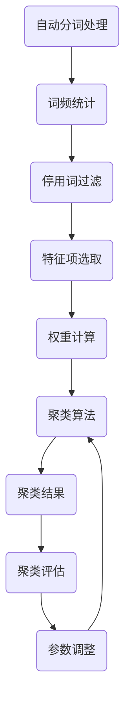

## 资料

* 自然语言处理实验（sougou数据集），TF-IDF，文本分类、聚类、词向量、情感识别、关系抽取等[GitHub](https://github.com/Roshanson/TextInfoExp)

---

## 文本聚类

##### 文本聚类的过程

```mermaid
graph TD
A(自动分词处理) -->B(词频统计)
B(词频统计)-->C(停用词过滤)
C(停用词过滤)-->D(特征项选取)
D(特征项选取)-->E(权重计算)
E(权重计算)-->F(聚类算法)
F(聚类算法)-->G(聚类结果)
G(聚类结果)-->H(聚类评估)
H(聚类评估)-->I(参数调整)
I(参数调整)-->F(聚类算法)
```

